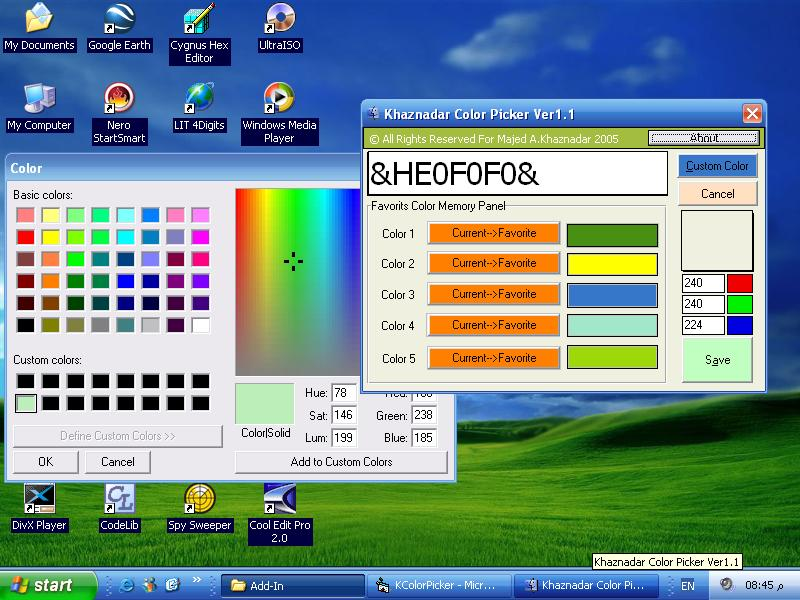



## Updated: Add\-in ColorPicker Ver1\.1

### Description

Add-in ColorPicker, is an updated version of the old one, but with the ability to capture any color you want right from anywhere in the screen!
 
### More Info
 
just make it in the System Directory

             |
---                |---
**Submitted On**   |2005-09-08 20:47:24
**By**             |[Majed A\.Khaznadar](https://github.com/Planet-Source-Code/PSCIndex/blob/master/ByAuthor/majed-a-khaznadar.md)
**Level**          |Advanced
**User Rating**    |4.8 (19 globes from 4 users)
**Compatibility**  |VB 6\.0
**Category**       |[Miscellaneous](https://github.com/Planet-Source-Code/PSCIndex/blob/master/ByCategory/miscellaneous__1-1.md)
**World**          |[Visual Basic](https://github.com/Planet-Source-Code/PSCIndex/blob/master/ByWorld/visual-basic.md)
**Archive File**   |[Updated\_\_A1931559102005\.zip](https://github.com/Planet-Source-Code/majed-a-khaznadar-updated-add-in-colorpicker-ver1-1__1-62513/archive/master.zip)

